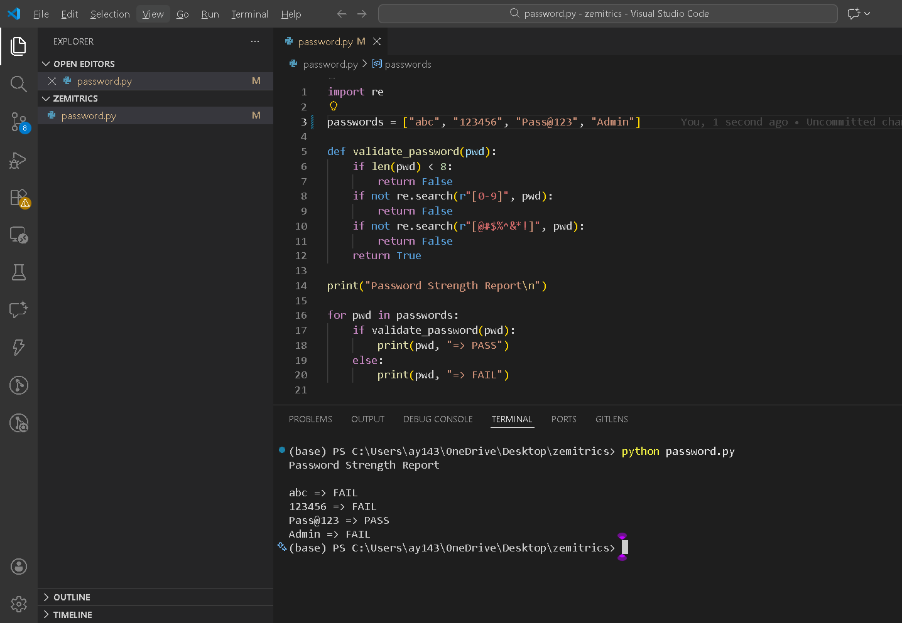

# zimetrics
This project validates a list of passwords based on security rules like length, number, and special characters using python  regular expression. 

# Password Strength Regex Tester

## Goal
This project validates a list of passwords based on security rules like length, number, and special characters.

## Setup Instructions
1. Install Python
2. Run:
   python password.py

## The Logic (How I Thought)
I chose this approach because password validation is a common testing scenario, and Python regular expressions allow simple and efficient rule-based checks. Each validation rule is separated to keep the logic readable and easy to debug.

The biggest challenge was ensuring that multiple validation rules were applied correctly without making the code complex. I solved this by validating each condition individually and returning clear pass or fail results.

## Challenges Faced
The main challenge was creating correct regex patterns for validation.

## Output

## Future Improvements
I would add uppercase and lowercase validation and store results in a file.
Allow user input instead of a hardcoded password list
Export validation results to a file
